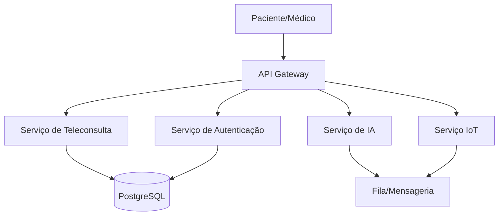

# HealthSync

## Visão Geral

O HealthSync é uma plataforma de telemedicina que integra consultas online, monitoramento remoto de pacientes via dispositivos wearable e recomendações médicas baseadas em Inteligência Artificial.

O sistema foi projetado para fornecer atendimento médico remoto seguro, escalável e altamente disponível, garantindo conformidade com a LGPD e suporte a múltiplos usuários simultâneos.

---

# Objetivos do Sistema

- Permitir consultas médicas online
- Monitorar pacientes remotamente
- Processar dados IoT em tempo real
- Gerar recomendações clínicas com IA
- Garantir segurança e alta disponibilidade

---

# Arquitetura

## Diagrama C4 — Containers



---

# Requisitos Não Funcionais

- Segurança
- Escalabilidade
- Disponibilidade
- Integridade de Dados
- Performance

---

# ADRs

- [ADR 0001 - Estratégia de Nuvem](docs/adrs/0001-estrategia-nuvem.md)
- [ADR 0002 - Padrão de Resiliência](docs/adrs/0002-padrao-resiliencia.md)
- [ADR 0003 - Modelo de Comunicação](docs/adrs/0003-modelo-comunicacao.md)

---

# Estrutura do Projeto

```text
diagrams/
└── diagrams/
docs/
├── adrs/
└── sad/
README.md
```

---

# Tecnologias Utilizadas

- Python
- Docker
- Kubernetes
- AWS
- PostgreSQL
- API Gateway
- Mensageria
- Microsserviços

---

